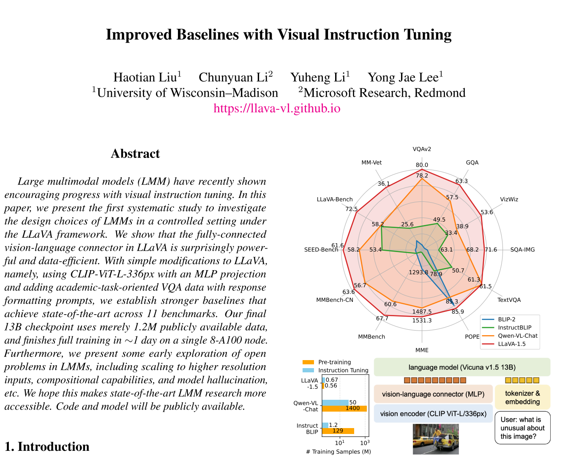
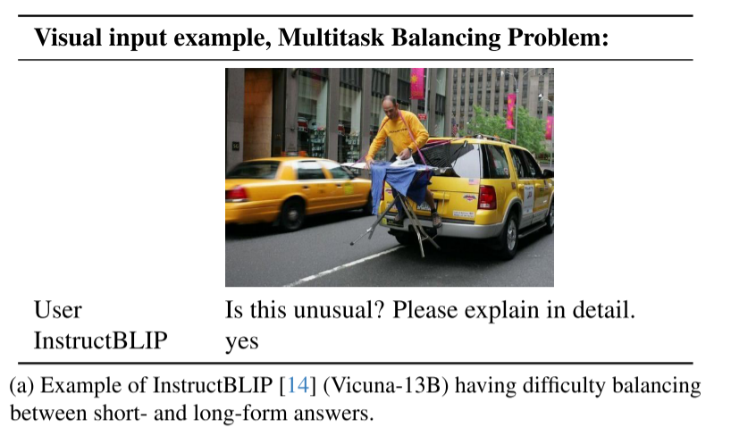
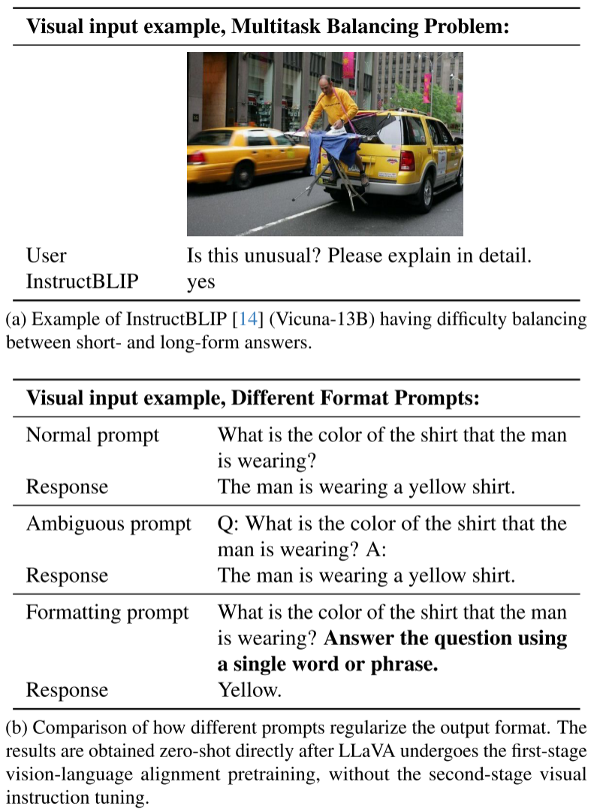
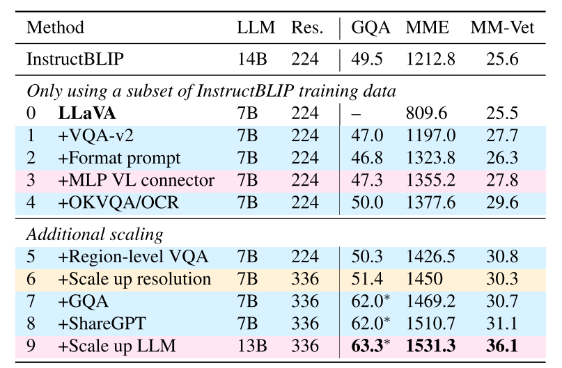
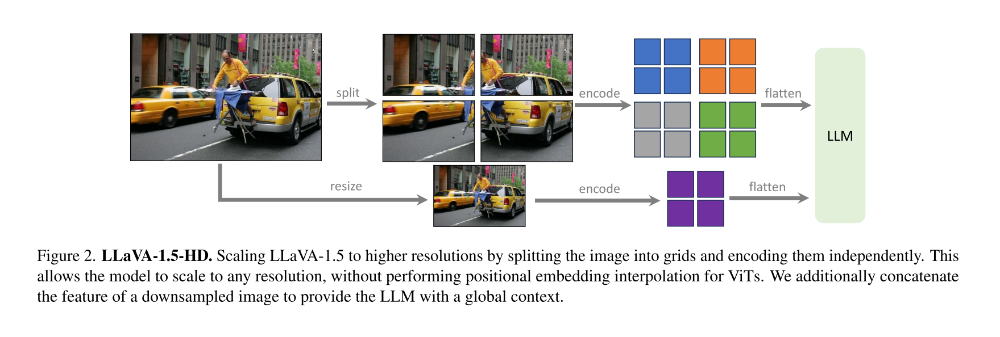
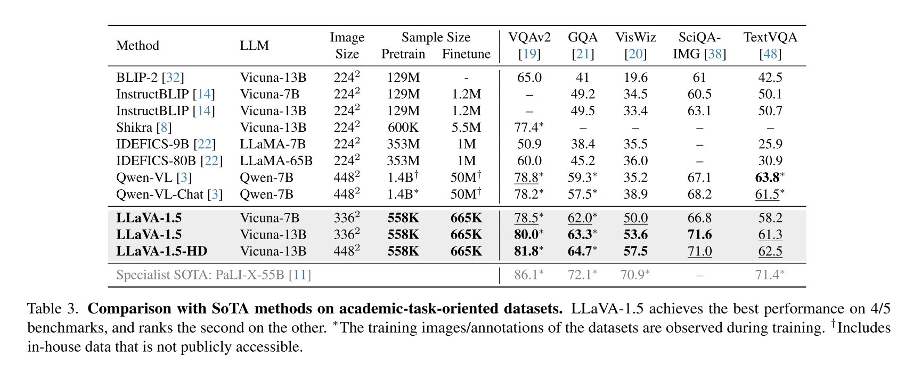
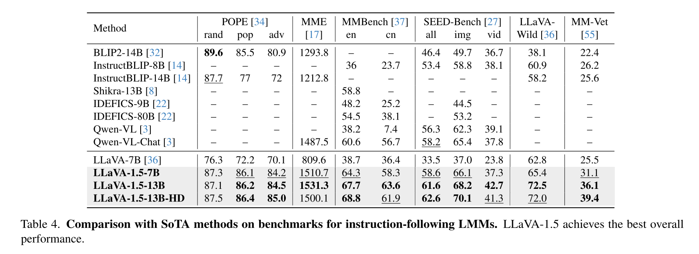
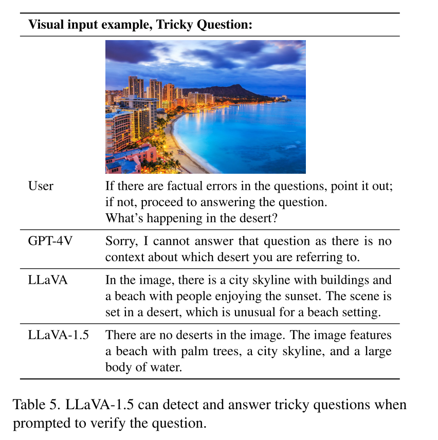
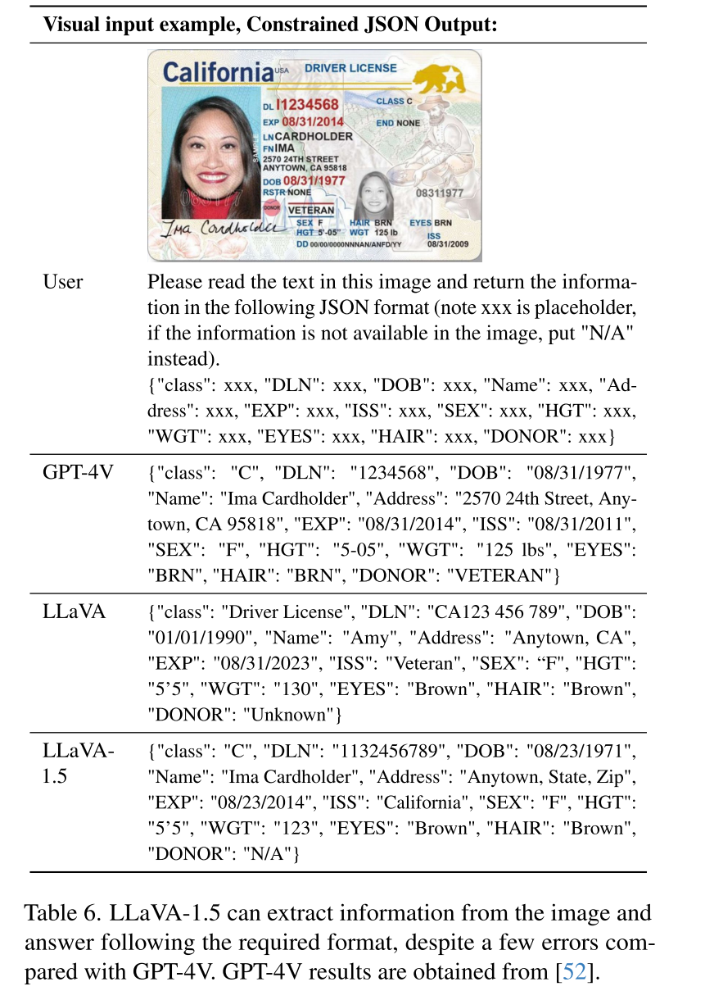

论文地址：<https://arxiv.org/pdf/2310.03744>

项目地址：<https://llava-vl.github.io/>

### 研究动机
#### 概要
Visual instruction tuning影响力正逐渐扩大，成为社区的研究重点，有很多benchmark被创建和其他进展，但问题是LLaVA虽然在自然语言对话方面很不错，但在短回答/面向学术任务型数据集上表现不佳，而InstructBLIP虽然采用了Q-former，在数据集引入了面向学术性任务，在此类问题中表现优异，但又在自然语言对话上不如LLavA。基于此，同时也是想研究LLM如何设计，因此本文系统的调查了在controlled setting下LMM的设计选择。

### A.Response Format Prompting
#### 概要
- LLaVA在自然语言对话上表现优异，但在VQA这类需要短回答的学术型任务上，通常没有简短的回答，同时，由于数据集缺乏类似于需要回答yes or no的任务，LLaVA更倾向于回答yes
- InstructBLIP将VQA-2和LLaVA-Instruct结合在一起来训练LLM，它在VQA benchmarks上表现优异。然而，有研究表明，在现实中的视觉对话任务中，它表现得不如LLaVA，且回答也往往保持着类似于学术型任务需要的短回答。如下图。

#### 原因
- 一、对于像InstructBLIP这样无法在长回答和短回答之间平衡的方法，作者发现主要是由于对回答格式的**prompt模糊不清**导致的(ambiguous prompts on the response format.)。例如 Q:{Question}  A:{Answer} 这样的输入，**没有显示的要求**回答格式，这使得LLM在行为上不适合在长回答和短回答之间平衡。
- 二、InstructBLIP在visual instruction tuning 阶段**仅针对Q-former进行微调**，这要求Q-former做到以下事情：将视觉特征对齐到LLM的embedding空间、根据图像特征来调整对齐向量使得LLM回答长/短回答。但这潜在的问题是，和LLM相比，**Q-former的容量可能太小**，无法同时做到这几点。而且，相比于冻结LLM的参数仅训练Projection层的Q-former让其调整回答风格相比，由**LLM自己调整回答**的格式/风格是更自然，更容易，也是更符合逻辑的事情

#### 解决
显示的指定回答的格式，将所需要的格式加到VQA问题的后面，例如Answer the question using a single word or phrase.如下图

通过这种方法，作者无需对VQA数据集在进行其他处理，将VQA-v2加入训练数据，就能在MME上显著提高(1323.8比809.6)，并比InstructBLIP高出111点。

### B.扩展数据集与模型
#### 更换Projection层
相比于原始LLaVA的单层线性层，本文把LLaVA中的Projection层**替换为2-layerMLP**，添加了更多的非线性，显著改善了视觉语言连接器的性能。这不难理解，一方面原本的线性层容量小，而且只能建模放射变换，现在引入了非线性，表达能力更强，能更好的捕捉到视觉和语言的差异。

#### 添加多样化的数据来从各方面提升模型能力
- academic-task-oriented VQA datasets for VQA 
- OCR 
- region-level perception 特别地，增加区域级的数据集，能够提升捕捉细粒度的能力

效果是显著的

#### 其他扩展
- 将视觉模型替换为CLIP-ViT-L-336px(CLIP分辨率最高的一版)，旨在增加模型的高分辨率能力，以及细节理解能力，让模型能够清楚地看到图像的细节。即， **视觉特征更细腻**，**空间分辨率更高**，**增强模型的视觉理解力**
- 加入GQA数据集和ShareGPT数据集，前者增**增强模型的视觉推理能力** ，后者让模型**学会更自然的回答**，**对多语言回答的学习**，以及**更好的多模态融合**

上表最后两行即为添加了所有改进后的模型结果，命名为LLaVA-1.5

### C.对高分辨图像的支持

#### 流程
- **目标分辨率选择 & 图像预处理**
    - 选定目标分辨率（最大可达 672×448 等）
    - 对输入图像进行填充，保证可以划分网格
- **图像分块**
    - 将图像拆成 **224² 的 patch**
- **每块编码**
    - 每个 patch 单独通过 **CLIP-ViT-L 编码器**
    - 得到每块的特征图
- **合并 patch 特征**
    - 将所有 patch 的特征拼接成 **大特征图**
- **添加全局上下文**
    - 对原图做下采样
    - 得到全局特征图
    - 将全局特征与合并后的大特征图 **拼接**
- **添加行尾 token（Row-end Token）**
    - 在每行视觉 token 的末尾添加特殊 token
    - 提供图像行的形状信息，辅助 LLM 捕捉图像布局
- **展平**
    - 将最终的二维视觉特征展平成一维 token 序列
    - 与语言 token 一起输入 LLM

##### 优劣
###### i)优
- 使得模型能够**支持任意分辨率的输入**，极大的增强了模型的细节处理能力
- **全局特征 + 局部特征结合，补足语义缺失**。引入全局下采样特征图，能够缓解由于图像切分成patch可能带来的伪影，同时引导模型更准确地聚焦于相关图像区域，改善高分辨率特征的利用效率
- **行尾Token 提供显式空间结构**。
- **不修改预训练 ViT 结构**，不需要重新训练或改架构。
- **平衡精度与算力**。 一方面可以并行处理，另一方面比直接把整张高分辨率图喂入 ViT 更高效。
###### ii)劣
- **加大计算资源以及训练时间**。引入了高分辨计算
- **patch 边界割裂上下文**。每个 patch 单独编码，ViT 看不到跨 patch 的关系，可能导致边界处的物体理解错误
- **行尾token粒度较粗**。它只提供“行”级别的位置信息，而不是像二维位置编码那样细粒度。
- **局部特征仅仅简单的拼接，和全局特征融合**。没有深度融合的板块，可能无法充分利用全局信息

但引入该方法显然是有益的：

### Results

##### LLaVA-1.5 在架构最简单、数据最小、计算资源最有限的情况下，在 **12 个基准测试** 上总体性能最佳。同时，LLaVA-1.5-HD（高分辨率版）在所有基准进一步提升，尤其在需要图像细节感知的任务中表现突出（如 OCR、细节描述）

#### 优势
- **架构极其简单**，没有复杂的 cross-modal 模块或 vision sampler。
- 所有组件均来自 **公开模型与公开数据**。
- 强调 **可复现性** 与 **可负担性**。

#### Emerging Properties
###### LLaVA-1.5 展现出强大的泛化能力——即使训练时数据有限，也能泛化到未见过的指令格式与多语言多模态任务。
###### Response Format Prompt
- **VizWiz 数据集**要求模型在无法回答时输出“Unanswerable”。LLaVA-1.5 经过response format prompt后，准确率从 **11.1% → 67.8%**，显著提升。
- 模型还能：
    - 识别并验证 **复杂或陷阱问题；
    - 按要求输出 **结构化 JSON 格式**；
    - 甚至在其他非训练格式的任务中保持一致性。(如下图)
    
  

###### Multilingual Multimodal Capability

虽然 LLaVA-1.5 从未在多语言视觉指令上微调（所有视觉任务均为英文），但模型**能理解并用多种语言回答视觉问题**。同时，和有专门对**中文多模态指令**进行微调的Qwen-VL-Chat 相比，**完全没有中文多模态训练**的LLaVA-1.5在**MMBench-CN** 上评估得出的结果为：
- **LLaVA-1.5：63.6%**
- **Qwen-VL-Chat：56.7%**

LLaVA-1.5比Qwen-VL-Chat高出7.3%，这证明确确实实存在泛化。

### D.消融实验
#### 对比模型

| 类型             | 模型名称         | 架构      | 训练方式        | 数据来源            |
| -------------- | ------------ | ------- | ----------- | --------------- |
| **LLaMA-1 系列** | Vicuna-v1.1  | LLaMA-1 | SFT（监督指令微调） | ShareGPT（~75K）  |
|                | Vicuna-v1.3  | LLaMA-1 | SFT         | ShareGPT（~150K） |
| **LLaMA-2 系列** | Vicuna-v1.5  | LLaMA-2 | SFT         | ShareGPT（~150K） |
|                | LLaMA-2-Chat | LLaMA-2 | SFT + RLHF  | 英文为主的对话数据       |
#### 发现
1. **底层 LLM 能力决定上层多模态表现**。LLaMA-2 系列总体优于 LLaMA-1 系列。**Vicuna-v1.5取得最佳整体性能。**
	- 说明底层语言模型的语言理解与推理能力，对多模态模型至关重要。

2. **指令微调数据类型影响特定任务表现**。不同的 instruction-tuning 数据集会影响模型在不同类型任务上的能力。
    - **Vicuna-v1.5**：包含多语言 ShareGPT 数据，在中文泛化上表现更好。
    - **LLaMA-2-Chat**：主要是英文 RLHF 数据，中文任务表现较弱。

3. **数据分布影响视觉任务的鲁棒性**
	- **TextVQA任务**不仅依赖OCR能力，还需理解来自 OCR 的噪声文本。
    - **ShareGPT** 数据来自真实用户对话，噪声多样、语言多样，训练出的模型更能处理“脏数据”和不规则输入。

### E.Open Problem
1. **Data Efficiency**
	- **全量数据性能最佳**。使用完整数据集时，模型覆盖知识最广、总体性能最优。
	- **数据减半**，但性能几乎不降。模型依然保留 **约 98% 的完整性能**。甚至在少部分任务上表现提升
	- **数据减至 30%**，但性能仍然稳定。这说明模型的鲁棒性强，但也可能说明训练数据重复，无意义更多，可以精心挑选具有代表性的，多样性的样本来训练，进一步压缩数据量。
2. **Rethinking Hallucination in LMMs**
	- **高分辨率能够减少幻觉**。分辨率上升，模型能看到更多细节，提升对图片的理解，自然会降低幻觉。
	- **如果数据粒度和模型能力不匹配，也会带来幻觉**。 若图像特征粒度较细，但LLM能力不足，无法充分利用信息，甚至可能因为信息太多，而带来更多的幻觉。
	- 即降低幻觉不仅是清理数据，更是**调整模型视野与理解能力**的问题。
3. **Compositional Capabilities**
	- 语言能力增强，视觉对话能力大幅提升。
	- 多语言视觉对话能力提升
	- 视觉理解更好
	- 更长、更细节的回答能力

### F.Limitations
- **训练高分辨率图像成本高**。高分辨率需要更多显存与训练时间
- **缺乏多图理解**。不能同时处理多张图像、视频等
- **领域问题解决能力有限**。专业知识不足
- **仍存在幻觉问题**

### G.总结
LLaVA-1.5 作为一个面向开源社区的多模态基线模型，通过在视觉指令调优、高分辨率扩展与多语言对齐上的系统分析，揭示了 LMM 设计中的关键因素与可控变量。  
它不仅验证了在有限数据下实现强多模态性能的可能性，还提出了关于幻觉来源与组合能力的新的理解，为未来研究提供了方向与参考。
但其仍存在计算成本高、缺乏多图语境、领域泛化不足以及幻觉未完全解决等问题；这些也构成了后续研究的自然延展方向。

### 测试
1)LLaVA-1.5 的总体设计核心是什么？

2)为什么把 connector 从线性换成两层 MLP？

3)为什么不直接用 Q-former？有什么权衡？有没有更优的 connector 设计，不用 Q-former 又强过 MLP？

4)split→encode→merge 的关键问题是什么？如何保证不丢全局信息？

5)论述 split→encode→merge 这种高分辨率方案的优缺点，并给出改进方案。

6)为什么要加 row-end token？

7)如何缓解模型 hallucination？

8)数据效率怎么证明？能下采样到多少仍保持性能？

9)如何评价“少量数据仍能保持性能”，是不是因为数据质量偏高？

10)LLM 基础模型选择对最终效果影响大吗？

11)多语言迁移为何能在未加图像多语言训练的情况下发生？
