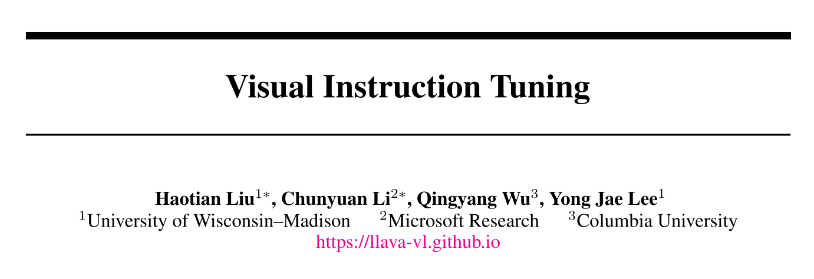
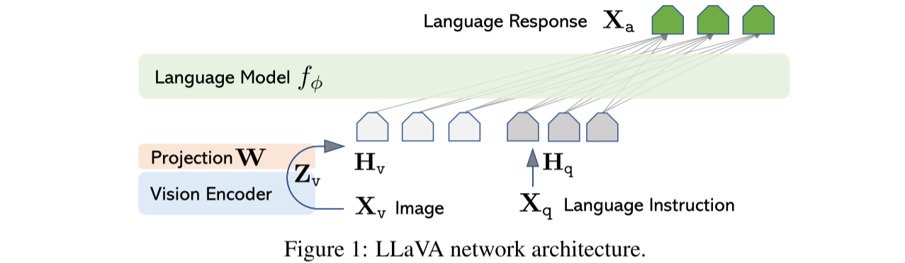
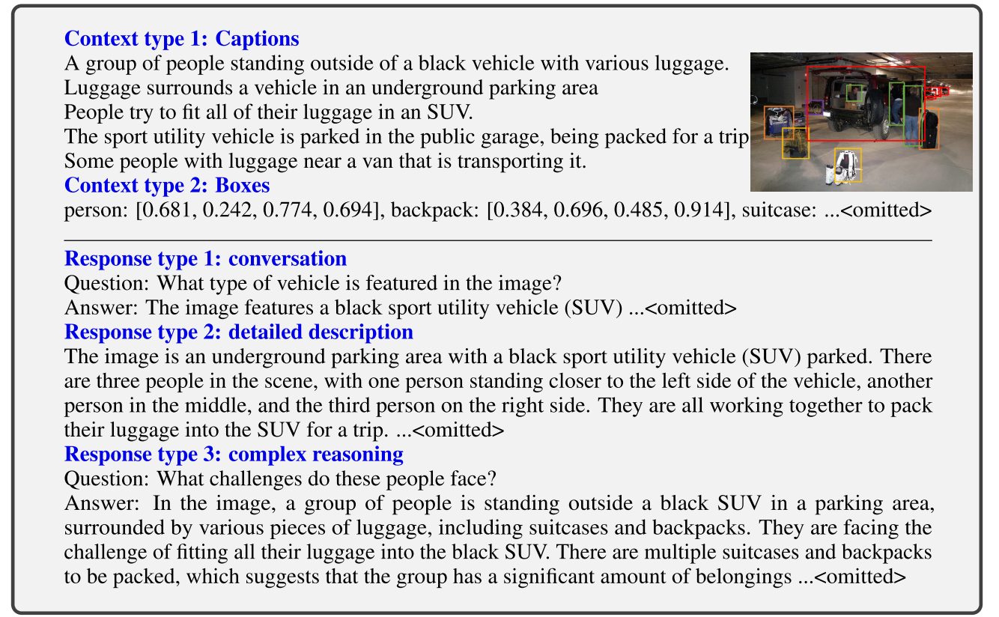
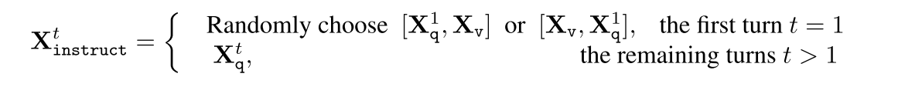
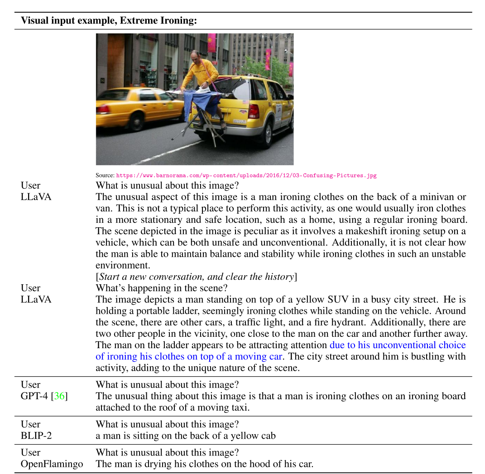
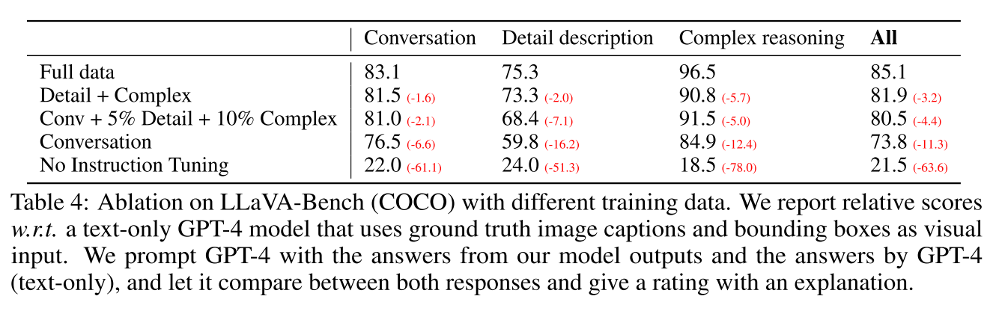
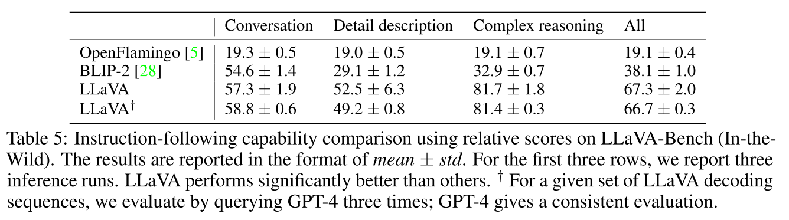
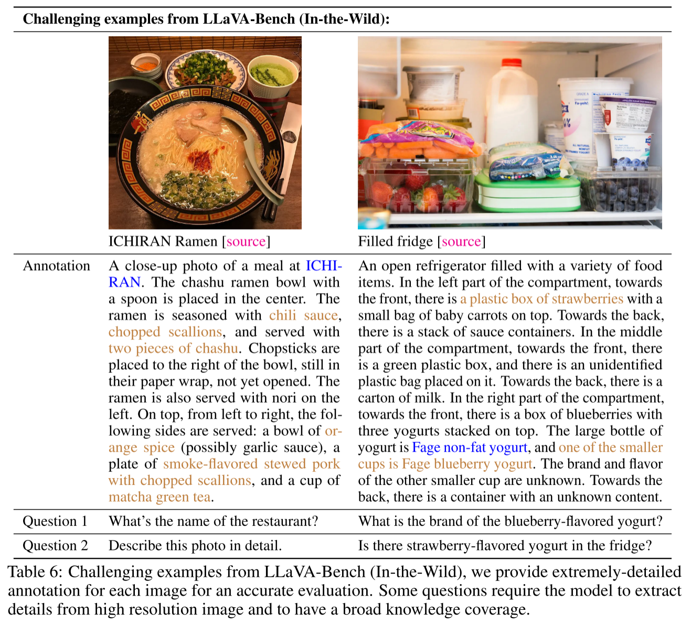

论文链接: <https://arxiv.org/pdf/2304.08485>

项目链接: <https://llava-vl.github.io/>

### 研究动机
- 随着 **大语言模型（LLM）** 具备了强大的推理与对话能力，本论文作者希望让模型“**既能看图又能对话**”——也就是 **Large Multimodal Model (LMM)**。
- 现有多模态模型（如 BLIP-2、Flamingo）虽然能进行视觉问答，但在诸多方面存在不足：
    - 缺乏强指令遵循能力（LLM难以生成符合用户需要的回答，难以自然流畅的与人对话）
    - 微调过程复杂
    - 数据规模要求大

**LLaVA 的目标**：
> 构建一个 “低成本、端到端、具有多模态强指令跟随能力” 的多模态对话模型。

### A.架构创新

#### 概要

**Vision Encoder:** pre-trained CLIP visual encoder ViT-L/14
**Projection:** a simple linear layer
**Language Model:** Vicuna

输入图像 $X_V$ ，使用视觉编码器提取图像特征，即 $Z_v = g(X_v)$ ，随后将提取到的图像特征 $Z_v$ 送入投影层 $W$ ，经过 **a simple linear layer** 得到 $H_v$ ，即 $$H_V=W*Z_v, Z_v = g(X_v)$$

简单的来说，作者通过一个投影层 $W$ 将图像特征 $Z_v$ 对齐到LLM的embedding空间，得到 $H_V$ ，其具有与LLM词嵌入空间相同的维度。

#### 优劣
使用简单的线性层来作为投影层是有**好处**的：
- **训练稳定、快速、低风险**。仅有一层线性层意味着**参数极少**，不会导致训练不稳定。这种设计确保了**LLM 的语义空间不被破坏**。只需训练 projection 层即可，**显著降低**显存和训练复杂度。
- **避免过拟合与灾难性遗忘**。因为 不更新 LLM 和 视觉模型的参数，只学习投影层，LLM 的语言能力以及视觉模型的提取能力几乎不受影响，避免破坏预训练参数。

当然**缺点**也很明显：
- 该方案是**线性**的，表达能力太弱，**难以捕获复杂模态关系**。线性层只能建模仿射变换，无法建模非线性变换。这导致模型对复杂视觉理解（如空间关系、动作、细节描述）较弱，只能粗略描述场景。
- **信息瓶颈**。LLaVA 直接 flatten CLIP的输出特征后平均池化或直接丢弃 patch token 仅保留 CLS token，极大地损失局部结构信息。因此模型只知道**图像主要在讲什么**，而**无法得知局部细节与关系**

### B.数据集创新

#### 概要
作者创新的使用了 **「多模态指令跟随（Instruction-following）」数据集** ，目的是为了让AI能更自然的与人对话，遵循人的要求回答。

通过该数据集，LLaVA做到了：
> 从 “图像问答” → “多模态对话理解与指令执行”

也就是说，它第一次让模型能理解：
> “请比较这两幅图的风格”，  
> “描述图片中人物的情感”，  
> “给我讲个关于这张图的故事”  
> 这种“高层语义+开放式任务”。

#### 样式
  - **Conversation** —— 多轮、自然、人机交互式的问题与回答，问题聚焦视觉内容，且只保留有确定答案的问题
  - **Detailed description** —— 用于生成丰富、全面的图像描述。通常从一个精心挑选的问题列表中随机抽题让 GPT-4 生成长而细致的描述。
- **Complex reasoning** —— 设计需要逐步逻辑推理才能得到答案的问题，答案要求有链式推理。

### C.训练（2-Stage）

#### Stage1：Pre-training for Feature Alignment.

目标是：
>让视觉编码器（CLIP）输出的图像特征能与语言模型（Vicuna）的词向量空间对齐。

**数据来源：**  
作者使用了 **CC3M 数据集（Conceptual Captions 3M）** 的子集（筛到 595K 张图），  
再用一个**非常朴素的“instruction expansion”方法**把原本的 image-caption 对变成了“instruction-following 数据”。即从(image, caotion)对，扩展成("image": image.jpg, "instruction": xxxx, “answer”xxxxxxxx: ) 对。

即上文所说的**多模态指令跟随（Instruction-following）」数据集**  中的
单轮instruction-following 对话

模型输入是：
目的是预测：

其中：
- $θ$：是唯一可训练的参数
- 视觉特征$H_v$ = $W*Z_v$ , $Z_v = g(X_v)$ 
- LLM 和 CLIP 编码器全都 **冻结不训练**。该阶段仅训练投影层

#### Stage2: Fine-tuning End-to-End.

目标是：
>让模型学会“遵循自然语言指令”进行多模态对话与推理

**数据来源：**  
**1.** 来自论文第 3 节构建的 **158K instruction-following 数据**，  
包括三种类型：

- Conversation（多轮对话）
- Detailed Description（单轮）
- Complex Reasoning（单轮）

**训练方式：**
- 在训练时，这三种样本**均匀采样（uniformly sampled）**；
- 输入为带图像的自然语言指令，输出为相应回答；

**2.** Science QA
输入 $X_{instruct}$ （问题 + 上下文（text/image）），输出 $X_a$ (推理过程 + 最终答案) 

**参数冻结** 
- CLIP 被冻结
- 投影层和LLM训练，前者调整视觉语义映射，后者学习理解视觉内容，理解指令，并控制回答风格，例如长度，形式，详细程度等等。

                               结果示例
### D.评估

#### 概要
作者提出了一个**基于 GPT-4 的多模态模型评估框架**，也就是所谓的 “LLM-as-a-Judge”。
##### 一、核心问题

多模态大模型不像纯语言模型( 可以直接用简单，已有的量化评估方法 ），  
因为它的输出往往是**自由形式的语言** ——这很难用自动指标去精确比较生成质量。

因此，LLaVA 作者设计了一个“间接评估”机制：

> 让 GPT-4 作为一个**客观裁判（judge）**，去对比不同模型的回答好坏。

##### 二、评估框架

他们构建了一个 **三元组** 结构：
$(\text{image}, \text{ground-truth description}, \text{question})$

然后让不同模型回答相同的问题：
- 模型 A（例如LLaVA）：看到 **图像 + 问题**；
- 模型 B（参考上限，纯文本的GPT-4）：看到 **ground-truth textual description + 问题**。

这样就有两组回答：
- $A_{\text{test}}$：待评估视觉模型的回答；
- $A_{\text{text-only GPT-4}}$：文本模型的“理论上限”回答。

然后，把两组回答送给GPT-4评审（评审GPT-4预先输入：question + textual description（代替视觉）+ 两个模型的回答），从4 个维度（Helpfulness, Relevance, Accuracy, Level of Detail）评估并给出总分（1–10），最后计算相对于上限（GPT-4-text） 的相对分数百分比。并且，它还会附上解释，以帮助研究者分析模型优劣点。

其中，各个维度的意义为：
- **Helpfulness** 回答是否对用户的问题有帮助
- **Relevance** 回答是否与图像与问题相关
- **Accuracy** 内容是否事实正确
- **Level of Detail** 信息是否充分、细节是否到位

##### 三、benchmark

###### 概要
作者构建了两种不同的benchmark，分别为受控环境（LLaVA-Bench (COCO)）与野外环境（LLaVA-Bench (In-the-Wild)）

其中，基于COCO数据集子集而生成的benchmark，其核心是：观察不同类型的 instruction-following 数据对模型对齐与指令遵循能力的影响。

论文发现，
- **指令调优本身极其有效**：  
	加入 instruction-following 数据，模型指令遵从能力飙升 >50 分。
- **少量复杂任务 → 全面提升**：  
    即便只添加少量 reasoning 与 detailed 描述数据，也能提高整体表现（+7 分）。
- **能力互补效应**：  
    reasoning 能力增强后，**对 conversation 的表现也有提升**，说明推理能力能反哺对话质量。
- **最佳方案**：  
    三种数据并用，表现最强（85.1% of GPT-4 text upper bound）。

  在In-the-wild benchmark下，目的是为了评估模型在**真实复杂场景与未知领域**中的泛化与推理能力。
  
  论文发现：
1. **视觉指令调优是决定性因素**
    - LLaVA 明显优于未进行此调优的模型（BLIP-2 / OpenFlamingo）。
    - 表明不是模型规模，而是数据与训练方式起主导作用。
2. **在复杂推理上接近 GPT-4 上限（81.7%）**
    - 模型能在复杂视觉逻辑问题中输出合理、详细、可解释答案。
3. **强泛化性**
    - 即使遇到未见过的图像风格或内容（meme、画作等），  
        模型仍能保持较高一致性和正确性。

### E.缺陷

#### 设计In the Wild
设计该benchmark目的不在于构建一个benchmark让自己的模型高分，而是在于暴露出模型的缺陷，从而为未来的研究寻找改进点。

例如：

在右图的测试中发现，
当问到冰箱里是否有草莓味酸奶时，模型回答 $yes$ ，  然而实际图像中只有“草莓”和“酸奶”，没有“草莓味酸奶”。

这说明 LLaVA把图像分块 patch 理解成“bag of patches”。它**缺乏全局语义组合能力**，没能捕捉到“草莓”和“酸奶”之间的语义关系，无法理解图像中复杂的语义。同时在左图的测试也暴露出知识覆盖不足，以及多语言理解有限等问题。

### 总结
**LLaVA** 通过构建并运用 **多模态指令跟随（visual instruction-following）数据集**，  
采用一层线性映射将视觉特征对齐到语言模型的嵌入空间，  
并提出了高效的 **两阶段（2-Stage）训练流程**——特征对齐预训练与指令微调，  
同时设计了 **LLaVA-Bench** 用于定量与定性评估，  
**成功开创了“视觉指令跟随”这一多模态学习新范式**，  
为后续 LMM（Large Multimodal Model）研究奠定了重要基础。

### 测试
1) LLaVA 的核心贡献是什么？为何重要？
2) 为什么只用一层线性层（W）作为视觉→语言的桥接？有什么利弊？
3) Stage1 与 Stage2 的具体训练流程与各自为什么冻结/解冻哪些模块？
4) 如何设计 ablation 实验验证“是否需要解冻 LLM”？
5) LLaVA 的评估如何设计？为何用 GPT-4 做 judge？用GPT-4评价可能有什么缺陷？
6) 为什么要用纯文本的GPT-4回答？这个“理论上限”可能有什么缺陷？
7) LLaVA 在哪些任务上会失败？失败模式是什么？可能的改进方法是什么？
8) 如何改进 LLaVA 的视觉→语言对齐模块？
9) GPT-4 自动生成用于 instruction-following 的数据有哪些风险与偏差？如何缓解？
10) LLaVA 为什么把“图像 embedding”当作一个或几个 visual tokens 插到 LLM？插入位置重要吗？
11) 如果把 LLaVA 中的线性层替换为 cross-attention，会发生什么？
12) LLaVA 的推广性如何？能否迁移到视频/音频/多图场景？
13) 给出线性投影 W 的学习目标（最大化似然），写出损失形式。
14) LLaVA 的“视觉 token”概念是否只是把图像变成“一个句子 token”？这是否过度简化？
15) 如何评估 LLaVA 在 benchmark 上的改进？
16) 原文中提到他们考虑了最后一层transformer前后的特征。你觉得为什么要这么做?
17) LLaVA 在“长期记忆/知识注入”方面能否做得更好？

